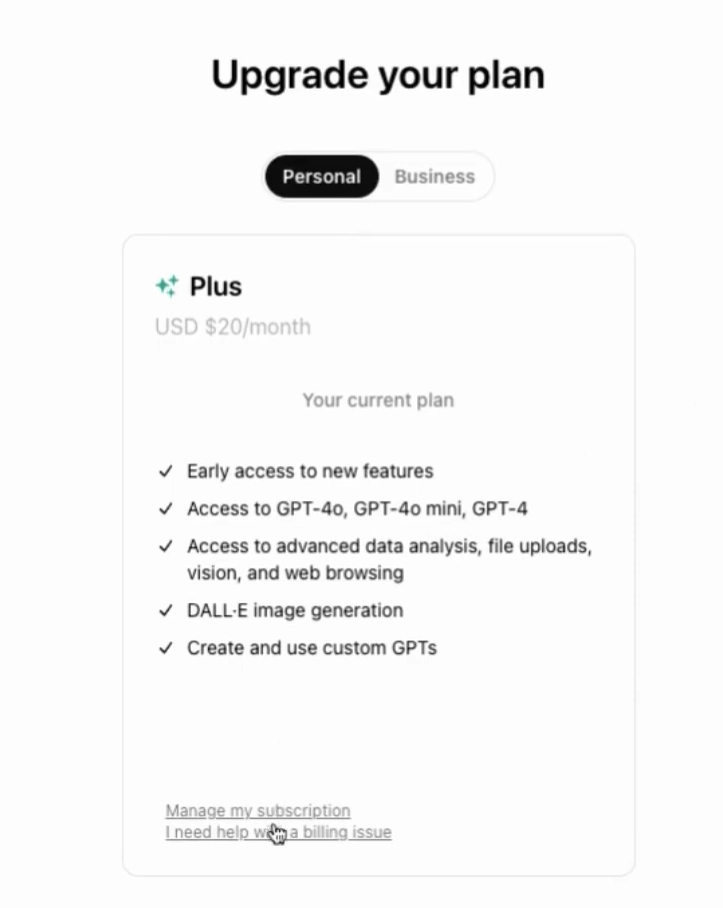
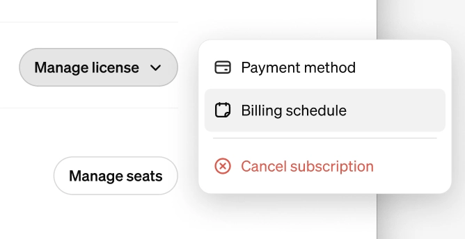
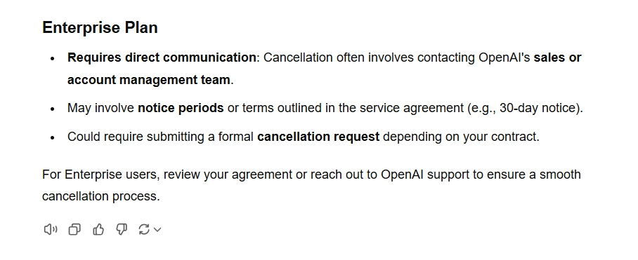
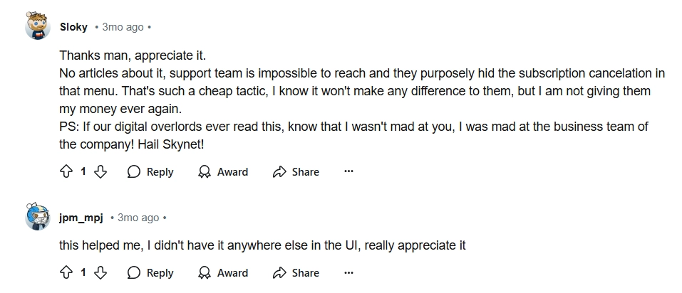
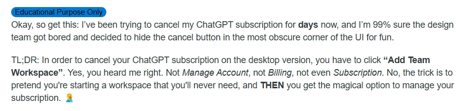
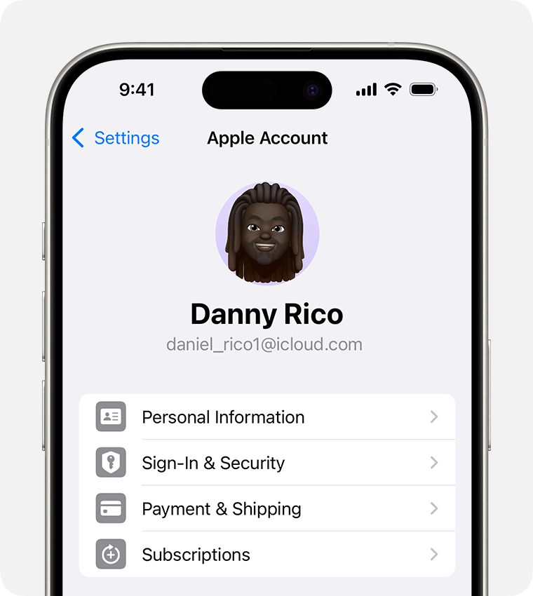
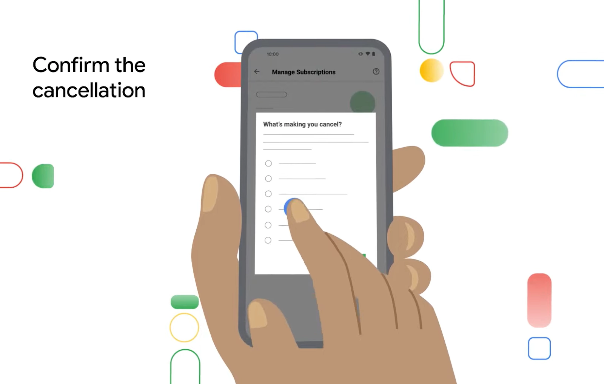

# 2025年如何取消ChatGPT订阅？（两种方法保姆级教程）

---

想取消ChatGPT Plus、Pro、Team或企业版订阅？说实话，这事儿比你想象的要复杂一点——因为OpenAI的取消流程藏得挺深的，有些用户甚至发现标准方法根本行不通。

这篇文章会教你两种实测有效的取消方法（包括手机端操作），还会聊聊为什么有些企业用户取消订阅后，转而选择了更灵活的替代方案。

---

## 如何取消ChatGPT订阅（桌面端）

### 方法一：标准取消流程

**取消Plus和Pro订阅**

在电脑上操作很简单：

- 点击左侧边栏底部的"View Plans"
- 在新页面选择"Manage my subscription"
- 在结账页面点击"Cancel Plan"

注意：只有Plus和Pro用户能看到"My Plan"选项。Team用户的取消方式不太一样。

**取消Team订阅**

Team用户需要：

- 进入账户详情中的"Manage subscription"
- 找到订阅详情里的"Team Plan"
- 点击"Cancel Plan"
- 按照提示确认取消

之后你会收到一封确认邮件，记得查收并确认。

**取消Enterprise订阅**

企业版就麻烦了——你需要直接联系OpenAI的客户管理团队。

根据合同条款，可能需要提前30天通知，或者提交正式的取消申请。说实话，这个流程我没亲自走过，网上也找不到太多案例。上面的信息是ChatGPT自己告诉我的（有点讽刺哈）。

### 方法二：备用取消方法（标准方法失效时用这个）

我在Reddit上看到有用户说标准方法对他们不管用。如果你也遇到这种情况，试试这个办法：

**备用取消步骤：**

- 点击"Add Team Workspace"
- 往下滚动，就像要设置新工作区一样
- 选择"Manage My Subscription"
- 在那里就能取消订阅了

这个方法有点绕，但确实有效。

## 手机端如何取消订阅

### iPhone用户（通过App Store订阅的）

如果你是在苹果商店订阅的：

- 打开iPhone的"设置"
- 点击你的名字，选择"订阅"
- 在活跃订阅列表里找到"ChatGPT"
- 选择"取消订阅"并确认

### Android用户（通过Google Play订阅的）

在Google Play商店取消：

- 打开Google Play商店，确认登录了正确的账号
- 点击菜单，然后选择"订阅"
- 找到ChatGPT Plus订阅，点击"取消订阅"
- 按照提示确认（可能会问你取消原因）

## 为什么有些团队用户选择离开ChatGPT？

坦白说，很多企业用户取消ChatGPT订阅，不是因为AI不好用，而是因为ChatGPT的一些限制让团队协作变得很别扭。

**最常见的两个痛点：**

1. **提示词数量限制**——用着用着就告诉你"今天额度用完了"
2. **无法共享对话**——团队成员之间没法直接查看彼此的聊天记录

如果你的团队也有这些困扰，其实有更适合团队协作的AI工具。比如一些专门为企业设计的AI平台，不仅能同时使用GPT-4、Claude、Gemini等多个模型，还支持共享对话、自定义提示词库、无限制使用等功能。

对于需要大规模部署AI的企业来说，👉 [选择一个支持团队协作、价格更透明的AI工具](https://shaoyumi.com/buy/65)往往比单纯使用ChatGPT更划算。毕竟ChatGPT Enterprise的起步价是25美元/用户/月，而有些替代方案只要20美元就能获得更多功能。

---

## 总结

取消ChatGPT订阅其实不难，关键是找对入口。如果标准方法不行，试试通过"Add Team Workspace"的备用路径。手机用户记得去对应的应用商店操作。

对于企业用户来说，取消订阅可能只是一个新开始。很多团队发现，换一个更适合协作的AI平台后，不仅成本更低，效率还更高。如果你也在考虑切换，👉 [了解一下专为团队设计的AI协作工具](https://shaoyumi.com/buy/65)——它们通常提供更灵活的定价和更强大的团队功能。
